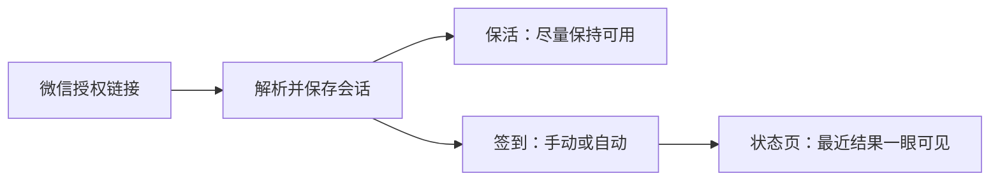

<div align="center">
  
  <h1>Wegolibrary</h1>
  <p>自托管的到馆/签到小助手：一次配置，日常省心。</p>
  <p>
    <a href="#快速开始">快速开始</a> ·
    <a href="#使用方式">使用方式</a> ·
    <a href="#管理员">管理员</a> ·
    <a href="#数据与安全">数据与安全</a>
  </p>
  <p>
    
    
    
    
  </p>
</div>

Wegolibrary 可搭配《我去图书馆》等相关使用场景：你在微信内完成授权后，把链接粘贴进来，系统会帮你保持会话尽量可用，并在你需要时执行签到；也支持按你的选择自动执行，并在状态页给出最近结果。

它支持多用户独立使用，也提供管理员后台，适合部署在自己的电脑或服务器上，作为一个轻量、可控的日常工具。



## 使用方式

打开网页后注册并登录，在“连接微信/配置”里粘贴微信授权链接（或直接粘贴会话信息）并保存。完成后即可手动签到；也可以开启自动签到，默认有效期到次日零点。

## 快速开始

推荐用 Docker 一键启动：

```bash
docker compose up -d --build
```

启动后访问：

- 前端：`http://localhost:18081`
- 后端：`http://localhost:18082`（通常无需直接打开）

数据默认保存在 `backend/data/database.db`（本地挂载，重启不丢）。

## 管理员

第一个注册的用户会自动成为管理员。管理员可以在后台查看所有用户的状态、删除用户，或在必要时为指定用户触发签到。

## 数据与安全

本项目运行在你自己的机器/服务器上，不需要把账号交给第三方；但你粘贴的会话信息等同于“登录凭证”，请像对待密码一样保管。

建议仅在可信网络环境部署；对外提供访问时启用 HTTPS，并更换后端登录密钥等基础安全配置。

## 免责声明

本项目仅用于学习与个人效率提升，请遵守相关平台与场景的使用规则；因使用不当造成的风险由使用者自行承担。
